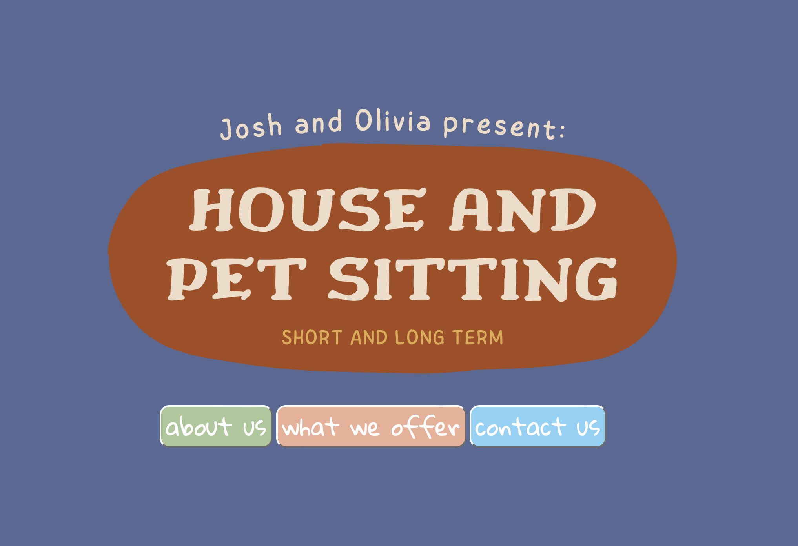
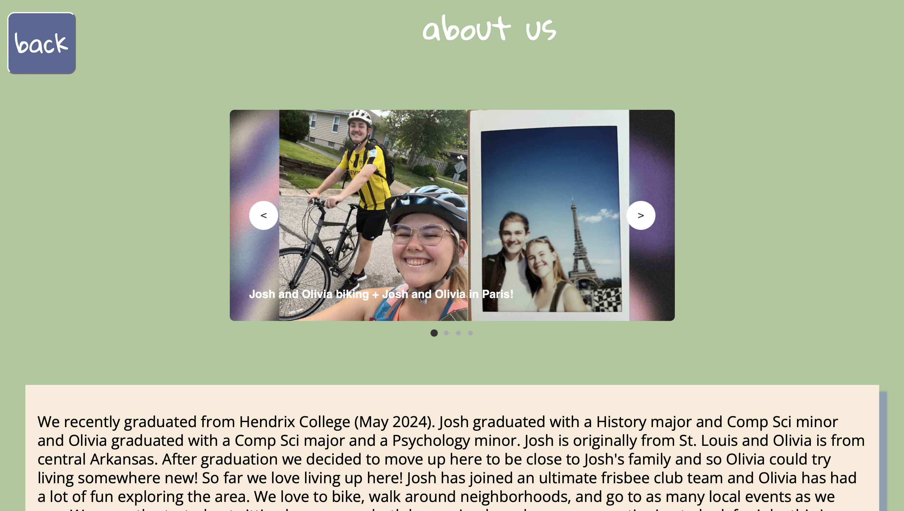

# HouseAndPetSitting
Josh Thomeczek and Olivia Larson both love to code and pet sit! So we decided to make our own website for our pet sitting business in St.Louis.

It is a HTML website that is hosted by firebase!

Feel free to look through our code for inspiration and if you are curious about how to host a website on Firebase check out my Final Senior Thesis Project. In the repository is a very long pdf about how to make a React website but it also includes how to use firebase (which was a very helpful reminder for me when making this website). 

You can see our website now at [jo-pet-sitting.web.app](https://jo-pet-sitting.web.app)

